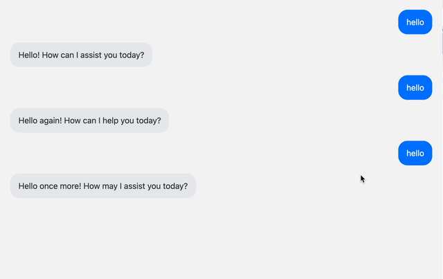

# STQRY Tech Test 2025

Welcome to the STQRY Tech Test.

To complete this test:

- Clone the repo
- `npm install`
- `npm run provision <candidateToken>`
- `npm run dev`
- Navigate to http://localhost:5173
- Complete the task
- `npm run submit <candidateToken>` when you're done

**Note**: don't fork the repo.

**Note**: use of AI is allowed.

**Note**: this test is not timed. We expect it to take about two hours or so.

# The Task

This is how the app works now:

Implement the following: 

